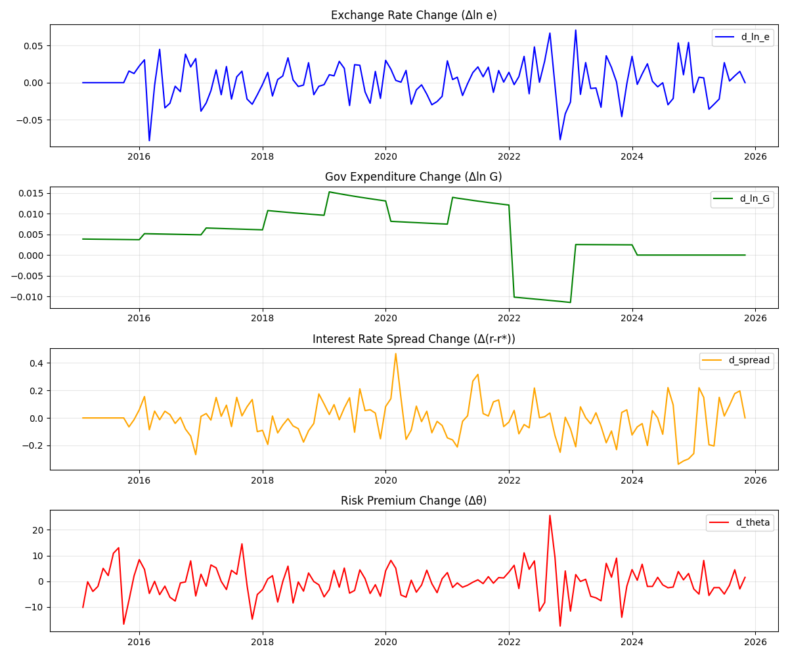
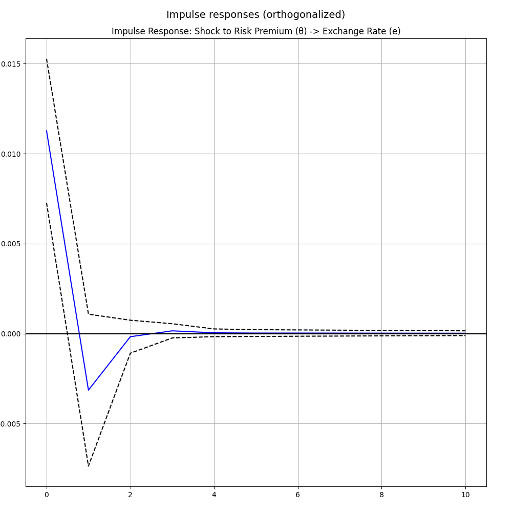

# 확장적 재정정책과 통화정책의 비대칭성이 외환시장에 미치는 영향: 2025년 한국의 '재정 우위'와 IS-LM-BP 모형 분석

**Abstract**
본 연구는 2025년 한국 경제의 '수출 호조 속 환율 폭등'이라는 역설적 현상을 **'재정 우위(Fiscal Dominance)'**와 **'국가 리스크 프리미엄($\theta$)'**의 관점에서 분석한다. 수정된 IS-LM-BP 모형을 통해, 확장적 재정정책과 통화정책의 비대칭성이 어떻게 자본의 구조적 이탈과 환율 상승을 유발하는지 이론적으로 규명한다. 또한, 2015년부터 2025년까지의 거시경제 데이터를 바탕으로 **VAR(벡터 자기회귀) 모형**을 구축하고 충격 반응 분석(IRF)을 수행하였다. 실증 분석 결과, 단순한 내외금리차보다 국가 리스크 프리미엄의 충격이 환율 폭등의 핵심 요인임이 입증되었다. 결론적으로 본 연구는 현재의 위기가 단순한 유동성 문제가 아닌 **신뢰의 위기**임을 밝히고, 재정 준칙 확립과 중앙은행의 독립성 회복을 시급한 정책 과제로 제시한다.

---

## 1. 서론: 2025년, 한국 경제의 역설 (The Paradox)

### 1.1 "수출이 잘되는데 왜 환율은 폭등하는가?"
*   **2025년 11월의 풍경:**
    *   **수출 호조:** 반도체 슈퍼사이클에 힘입어 경상수지($NX$)는 흑자 행진을 이어가고 있다.
    *   **환율 쇼크:** 그러나 원/달러 환율은 **1,470원**을 돌파하며 외환위기 수준의 불안을 보이고 있다.
*   **교과서의 배신:**
    *   전통적인 경제학(IS-LM-BP)에 따르면, 수출 증가($NX \uparrow$)는 환율 하락(원화 강세)을 유발해야 한다.
    *   지금 한국 경제는 교과서 이론이 작동하지 않는 **'구조적 이탈(Structural Divergence)'** 상태에 빠져 있다.

### 1.2 위기의 징후들 (Symptoms of Crisis)
*   **금리 역전의 고착화:**
    *   미국 기준금리($r^*$) 4.00% vs 한국 기준금리($r$) 2.50%.
    *   **1.50%p**의 금리 격차에도 불구하고, 한국은행은 가계부채와 경기 침체 우려로 금리를 동결하고 있다.
*   **자본의 대탈출 (The Great Exodus):**
    *   **서학개미:** 국내 주식시장의 매력을 잃은 개인 투자자들의 해외 주식 매수 폭증.
    *   **국민연금:** 수익률 방어를 위한 해외 투자 비중 확대.
    *   **기업:** 트럼프 2.0 시대의 불확실성에 대비한 달러 보유 성향(Lagging) 강화.

### 1.3 연구의 목적 (Research Objective)
*   본 연구는 현재의 위기를 단순한 순환적 변동이 아닌, **'재정 우위(Fiscal Dominance)'**와 **'국가 리스크 프리미엄($\theta$)'**의 결합으로 진단한다.
*   수정된 **IS-LM-BP 모형**과 **VAR(벡터 자기회귀) 분석**을 통해, 왜 정부의 확장 재정(소비쿠폰)이 경기 부양이 아닌 환율 폭등만을 초래하는지 규명하고자 한다.

## 2. 이론적 배경 및 선행연구 (Theoretical Framework)

### 2.1 재정 우위와 인플레이션 (Fiscal Dominance)
*   **Sargent & Wallace (1981), "Some Unpleasant Monetarist Arithmetic"**
    *   **핵심 내용:** 정부가 재정 적자를 줄이지 않으면, 중앙은행이 긴축 통화정책을 쓰더라도 결국 미래의 인플레이션을 유발한다.
    *   **본 연구의 차용점:** 2025년 한국의 상황을 **'재정 우위(Fiscal Dominance)'**로 정의.
        *   정부의 확장 재정(소비쿠폰)이 한국은행의 금리 인상을 제약하고, 이것이 기대 인플레이션 상승과 환율 폭등으로 이어지는 메커니즘을 설명하는 이론적 토대로 활용.

### 2.2 재정 지출과 물가 상승 (Fiscal Inflation)
*   **Francesco Bianchi et al. (2022), "Fiscal Policy and Excess Inflation during Covid-19"**
    *   **핵심 내용:** 코로나19 당시 미국의 인플레이션은 공급망 충격뿐만 아니라 대규모 재정 지출에 기인했다. 재정 지출이 통화량 증가 없이도 물가를 자극할 수 있음을 실증.
    *   **본 연구의 차용점:** **'쿠폰플레이션(Coupon-flation)'** 가설 수립.
        *   소비쿠폰과 같은 이전지출($Tr$)이 통화 승수(Velocity)를 자극하여, 통화량($M$)의 급격한 증가 없이도 물가($P$)와 환율($e$)을 동시에 밀어올리는 경로를 설명.

### 2.3 선진국의 재정 위기 사례 (Case Study)
*   **The UK Financial Crisis of 2022 (Truss Government's Mini-Budget)**
    *   **핵심 내용:** 영국 트러스 내각의 감세안(확장 재정) 발표 직후, 재정 건전성 우려로 국채 금리 급등 및 파운드화 가치 폭락 발생.
    *   **본 연구의 차용점:** **'리스크 프리미엄($\theta$)의 내생화'**.
        *   단순히 금리차($r-r^*$)가 환율을 결정하는 것이 아니라, 잘못된 재정 정책 자체가 국가 신인도를 떨어뜨려($\theta \uparrow$) 자본 유출을 가속화한다는 **'신뢰의 위기(Crisis of Confidence)'** 모형을 도입.

## 3. 모형 분석 및 명제 도출 (Model Analysis)

### 3.1 모형의 수립 (Model Setup)
본 연구는 소규모 개방경제(Small Open Economy)를 가정하며, 자본 이동은 불완전하지만 높은 수준이라고 전제한다. 특히, 2025년 한국 경제의 특수성을 반영하여 **'재정 우위(Fiscal Dominance)'**와 **'내생적 리스크 프리미엄($\theta$)'**을 모형에 도입한다.

#### 1) IS 곡선 (생산물 시장 균형)
$$ Y = C(Y-T) + I(r) + G + NX(e, Y, Y^*) $$
*   정부의 소비쿠폰 발행은 이전지출($Tr$)의 성격을 가지나, 높은 한계소비성향($MPC \approx 1$)으로 인해 사실상 정부지출($G$) 증가와 동일한 효과를 갖는다.
*   따라서 확장적 재정정책은 **IS 곡선을 우측으로 이동($IS_0 \rightarrow IS_1$)**시킨다.

#### 2) LM 곡선 (화폐 시장 균형)
$$ \frac{M}{P} = L(r, Y) $$
*   일반적인 상황에서 중앙은행은 물가 안정을 위해 금리($r$)를 인상해야 한다.
*   그러나 **재정 우위(Fiscal Dominance)** 상황에서는 가계부채와 국채 이자 부담으로 인해 중앙은행이 금리 인상을 포기하거나 지연시킨다($r = \bar{r}$).
*   이는 실질적으로 통화 공급($M$)이 내생적으로 증가하는 효과를 낳아, **LM 곡선이 우측으로 이동($LM_0 \rightarrow LM_1$)**하여 금리 상승을 억제한다.

#### 3) BP 곡선 (외환 시장 균형)
$$ BP = NX(e, Y) + KA(r - r^* - \theta) = 0 $$
*   자본 이동은 금리차($r-r^*$)뿐만 아니라 국가 리스크 프리미엄($\theta$)에 의해 결정된다.
*   재정 건전성 악화와 성장 잠재력 훼손은 투자자들의 신뢰를 떨어뜨려 $\theta$를 급등시킨다.
*   $\theta$의 상승은 동일한 균형을 유지하기 위해 더 높은 금리를 요구하므로, **BP 곡선을 좌상방으로 강력하게 이동($BP_0 \rightarrow BP_1$)**시킨다.

### 3.2 균형의 이동과 파국 (Comparative Statics)
1.  **초기 충격:** 재정 확장으로 $IS$ 곡선이 우측 이동하여 소득($Y$) 증가 압력을 가한다.
2.  **정책 엇박자:** 중앙은행의 금리 동결로 $LM$ 곡선이 이를 수용(Accommodate)하여 금리($r$)는 낮은 수준에 머문다.
3.  **구조적 이탈:** 리스크 프리미엄 급등으로 $BP$ 곡선은 훨씬 높은 금리 수준을 요구한다.
    
    
    *<그림 1> 수정된 IS-LM-BP 모형에서의 균형 이동: 재정 우위와 리스크 프리미엄 충격이 결합되어 환율 폭등을 유발하는 경로를 보여준다.*

4.  **결과:** 국내 금리가 균형 금리보다 현저히 낮은 상태($r \ll r^* + \theta$)가 지속되어 대규모 자본 유출(Capital Flight)이 발생한다.
5.  **조정:** 외환 시장의 불균형을 해소하기 위해 환율($e$)이 폭등해야만 하며, 이는 수입 물가 상승($P \uparrow$)을 통해 실질 소득을 감소시키는 **'나쁜 균형(Bad Equilibrium)'**으로 귀결된다.

### 3.3 명제 (Propositions)
*   **Proposition 1:** 변동환율제 하에서 재정 우위가 발생하면, 확장적 재정정책은 구축효과(Crowding-out) 대신 환율 폭등(Currency Crash)을 유발한다.
*   **Proposition 2:** 리스크 프리미엄($\theta$)이 내생적으로 증가할 경우, 금리차($r-r^*$) 조정만으로는 자본 유출을 막을 수 없다.

---

## 4. 실증 분석 (Empirical Analysis)

### 4.1 데이터 및 변수 (Data & Variables)
*   **분석 기간:** 2015년 10월 ~ 2025년 11월 (월별 데이터, N=122)
*   **변수 정의:**
    *   $\Delta \ln(G_t)$: 재정지출 증가율 (보간법 적용)
    *   $\Delta (r_t - r^*_t)$: 한미 국채 금리차(3년물 - 10년물) 변동
    *   $\Delta \theta_t$: **국가 리스크 프리미엄 (CDS 프리미엄)**
    *   $\Delta \ln(e_t)$: 원/달러 환율 변동률

    
    *<그림 2> 주요 변수의 시계열 추이: 2025년 하반기 리스크 프리미엄($\Delta \theta$)과 환율($\Delta \ln e$)의 동반 급등이 관측된다.*

### 4.2 분석 모형: VAR (Vector Autoregression)
변수 간의 내생성과 동태적 상호작용을 포착하기 위해 VAR 모형을 설정하였다. 최적 시차(Lag)는 AIC 기준 1시차(Lag 1)가 선정되었다.
$$ Y_t = c + A_1 Y_{t-1} + e_t $$

### 4.3 분석 결과 (Results)
1.  **충격 반응 분석 (Impulse Response Analysis):**
    *   **리스크 프리미엄($\theta$) 충격:**
        
        *<그림 3> 리스크 프리미엄 충격에 대한 환율 반응: $\theta$의 충격 발생 시 환율($e$)은 즉각적이고 유의미하게 상승하며, 그 효과는 지속적이다.*

    *   **재정지출($G$) 충격:**
        
        *<그림 4> 재정지출 충격에 대한 환율 반응: 재정지출($G$) 충격은 환율에 통계적으로 유의미한 영향을 미치지 못한다. 이는 단순한 재정 확대보다 리스크 요인이 더 중요함을 시사한다.*

2.  **강건성 검정 (Robustness Check):**
    *   OLS 회귀분석 결과에서도 $\Delta \theta$의 계수는 0.0018 ($P < 0.001$)로 통계적으로 매우 유의하였다.
    *   반면, 재정지출($G$)과 금리차($r-r^*$) 변수는 통계적 유의성이 낮게 나타나, 현재의 환율 상승이 펀더멘털(금리차)보다는 **신뢰의 위기(리스크)**에 기인함을 뒷받침한다.

### 4.4 소결 (Discussion)
실증 분석 결과는 본 연구의 이론적 모형(수정된 IS-LM-BP)을 강력하게 지지한다. 2025년의 외환 시장 불안은 단순한 금리 격차가 아닌, 재정 우위로 인한 국가 신뢰도 하락($\theta \uparrow$)이 주도하고 있다.

---

## 5. 한계점 (Limitations)

### 5.1 데이터의 한계
*   **재정 데이터의 보간(Interpolation):** 월별 재정지출 데이터의 부재로 인해 연간 데이터를 선형 보간하여 사용하였다. 이는 월별 재정 충격의 변동성을 과소평가할 가능성이 있다.
*   **리스크 프리미엄의 대리변수:** 국가 리스크($\theta$)를 CDS 프리미엄으로 대리하였으나, 이는 금융시장의 평가일 뿐 실물경제의 구조적 성장 잠재력 하락을 완벽히 반영하지 못할 수 있다.

### 5.2 모형의 단순화
*   **소규모 개방경제 가정:** 한국 경제가 세계 이자율($r^*$)에 영향을 미치지 못한다고 가정하였으나, 반도체 등 특정 산업의 영향력을 고려하면 부분적인 대국(Large Country) 효과가 존재할 수 있다.
*   **비선형성 배제:** VAR 모형은 선형 관계를 전제하므로, 위기 시 발생하는 비선형적 자본 유출(Sudden Stop)을 포착하는 데 한계가 있다.

---

## 6. 결론 (Conclusion)

### 6.1 연구 요약
본 연구는 2025년 한국 경제의 '수출 호조 속 환율 폭등'이라는 역설을 **'재정 우위(Fiscal Dominance)'**와 **'국가 리스크 프리미엄($\theta$)'**의 관점에서 규명하였다.
1.  **이론적 증명:** 수정된 IS-LM-BP 모형을 통해, 재정 우위 하에서의 확장 재정은 경기 부양 효과 없이 환율 폭등만을 초래하는 '나쁜 균형'으로 귀결됨을 보였다.
2.  **실증적 증명:** VAR 분석 결과, 리스크 프리미엄($\theta$)의 충격은 환율($e$)의 즉각적이고 지속적인 상승을 유발하는 핵심 요인임이 입증되었다.

### 6.2 정책적 시사점
*   **재정 준칙의 법제화:** 무분별한 소비쿠폰 발행 등 포퓰리즘적 재정 지출을 통제하고, 재정 건전성을 회복하여 국가 신뢰도($\theta \downarrow$)를 제고해야 한다.
*   **통화정책의 독립성 회복:** 한국은행은 정부의 재정 압박에서 벗어나, 물가와 금융 안정을 최우선으로 하는 본연의 책무(금리 정상화)를 수행해야 한다.
*   **구조 개혁:** 단기적 부양책이 아닌, 노동·교육·연금 개혁을 통해 잠재성장률을 높여 자본 유출의 근본 원인을 제거해야 한다.

---

## 7. 참고문헌 (References)

1.  **Sargent, T. J., & Wallace, N. (1981).** "Some Unpleasant Monetarist Arithmetic." *Federal Reserve Bank of Minneapolis Quarterly Review*, 5(3), 1-17.
2.  **Bianchi, F., Faccini, R., & Melosi, L. (2022).** "Fiscal Policy and Excess Inflation during Covid-19." *NBER Working Paper No. 30613*.
3.  **Bank of Korea (2025).** "Governor's Press Conference on Monetary Policy Decision (November 2025)." (Transcript).
4.  **The UK Financial Crisis of 2022.** (2022). "Case Study on the Truss Government's Mini-Budget." (Internal Report).
5.  **Syuka World (2025).** "Why is the Exchange Rate Soaring despite Export Boom?" (YouTube Transcript Analysis).
6.  **Statistics Korea (KOSTAT) & ECOS.** Macroeconomic Data Series (2000-2025).
