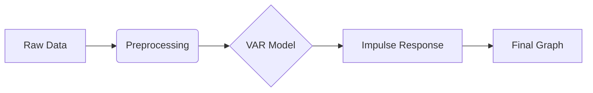

<!-- _class: lead -->

# Project Cassandra
## "The Paradox of 2025: Why is the Exchange Rate Soaring?"

**2025 Economics Academic Festival**
*Fiscal Dominance & Exchange Rate Crisis*

---

## 1. System Architecture (AI Collaboration)

### "3 Agents, 1 Goal"
*   **🧠 Brain (Planner):**
    *   이론 수립 (IS-LM-BP) & 연구 기획.
*   **📚 Librarian (Data Miner):**
    *   한국은행/미디어 데이터 채굴 & 전처리.
*   **💻 Coder (Analyst):**
    *   VAR 모형 코딩 & 충격 반응 분석(IRF).

---

## 2. Research Workflow

### "From Data to Policy"
1.  **Problem Definition:** 수출-환율 괴리 식별.
2.  **Data Mining:** 월별 거시경제 데이터 수집 (2015-2025).
3.  **Modeling:**
    *   **OLS:** 선형 관계 검증.
    *   **VAR:** 동태적 충격 분석.
4.  **Conclusion:** 정책 제언 도출.

---

## 3. Technical Pipeline

### "Automated Analysis"

*   **Input:** `merged_monthly_data.csv`
*   **Process:** Python (`statsmodels`, `pandas`)
*   **Output:** `var_irf_theta_to_e.png`

---

## 4. The Paradox: 교과서의 배신

### "수출이 잘되는데 왜 환율은 폭등하는가?"
*   **2025년 11월의 미스터리:**
    *   **수출 호조 ($NX \uparrow$):** 반도체 슈퍼사이클 진입.
    *   **환율 쇼크 ($e \uparrow$):** 원/달러 환율 **1,470원** 돌파.
*   **구조적 이탈 (Structural Divergence):**
    *   전통적 경제 이론(IS-LM-BP)의 예측(환율 하락)이 빗나감.
    *   단순한 유동성 문제가 아닌 **구조적 위기**의 신호.

---

## 5. Symptoms & Diagnosis (위기의 징후)

### "금리는 묶였고, 자본은 떠난다"
1.  **Fiscal Dominance (재정 우위):**
    *   한미 금리차 **1.5%p** 역전 ($r_{US}=4.0\% > r_{KR}=2.5\%$).
    *   가계부채와 경기 침체 우려로 **한국은행 금리 동결**.
2.  **The Great Exodus (자본 대탈출):**
    *   서학개미, 국민연금, 기업의 달러 보유 성향(Lagging) 강화.
    *   투자 수익을 넘어선 **'생존을 위한 탈출'**.

---

## 6. Theoretical Framework (이론)

### 수정된 IS-LM-BP 모형
$$ BP = NX(e) + KA(r - r^* - \theta) = 0 $$

*   **$\theta$ (Risk Premium):** 국가 신뢰도 및 성장 잠재력.
*   **Mechanism:**
    1.  방만한 재정(소비쿠폰) $\rightarrow$ 신뢰 하락 $\rightarrow$ **$\theta$ 급등**.
    2.  BP 곡선 **좌상방 이동 (Shift Up)**.
    3.  금리 인상 없이는 자본 유출을 막을 수 없는 **'나쁜 균형'**.

---

## 7. Market Perception (시장의 인식)

### "시장은 무엇을 두려워하는가?"
*   해외투자 확대, 트럼프 리스크, 국민연금 등이 주요 원인으로 지목됨.

---

## 8. Empirical Evidence (실증 분석)

### "진짜 범인은 리스크 프리미엄($\theta$)"
*   **VAR 충격 반응 분석 (Impulse Response):**

*   **결과:** 리스크($\theta$) 충격 시 환율($e$)은 **즉각적이고 폭발적으로 상승**.

---

## 9. Conclusion (결론)

### "신뢰의 위기, 해법은 원칙에 있다"

*   **진단:** 2025년의 위기는 외부 충격이 아닌, **'재정 우위'**가 초래한 **내부의 신뢰 위기**.
*   **제언:**
    1.  **Fiscal Rule:** 무분별한 확장 재정 중단 및 재정 준칙 확립.
    2.  **Independence:** 한국은행의 통화 정책 독립성 회복.
    3.  **Trust:** 구조 개혁을 통한 국가 리스크($\theta$) 축소.

---

<!-- _class: lead -->

# Q & A
## Thank You

**Project Cassandra**
